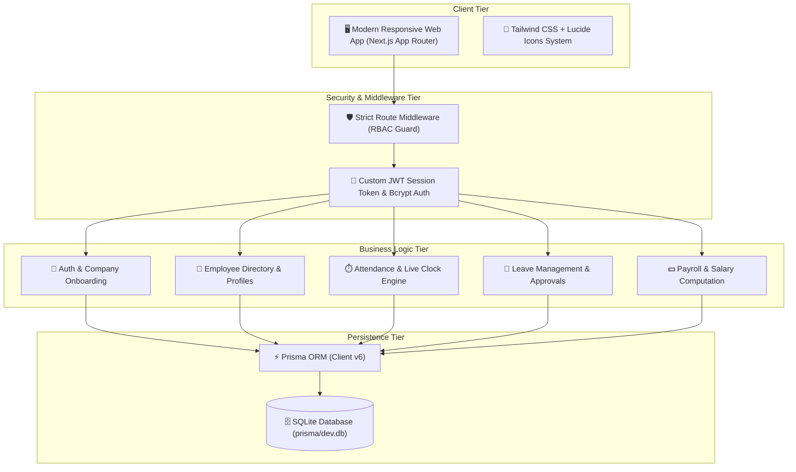
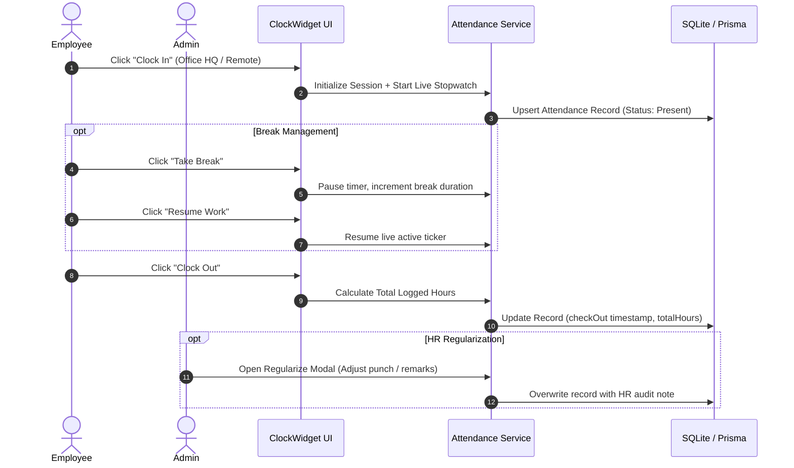
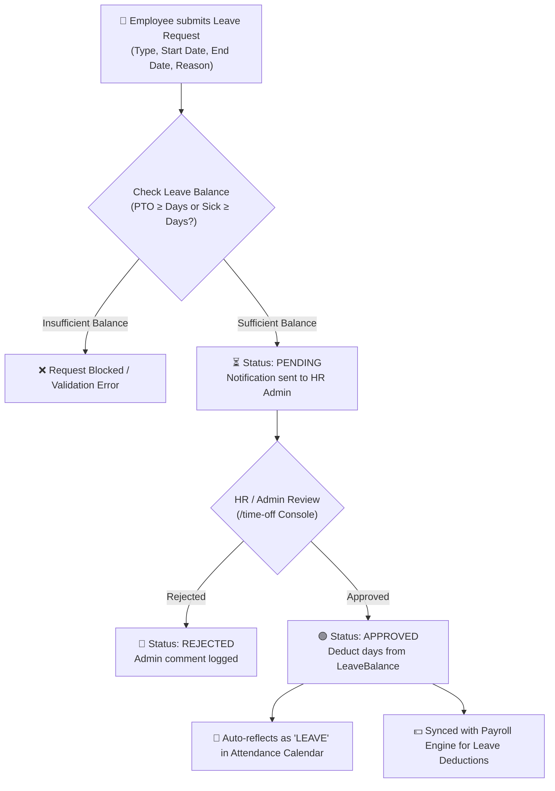
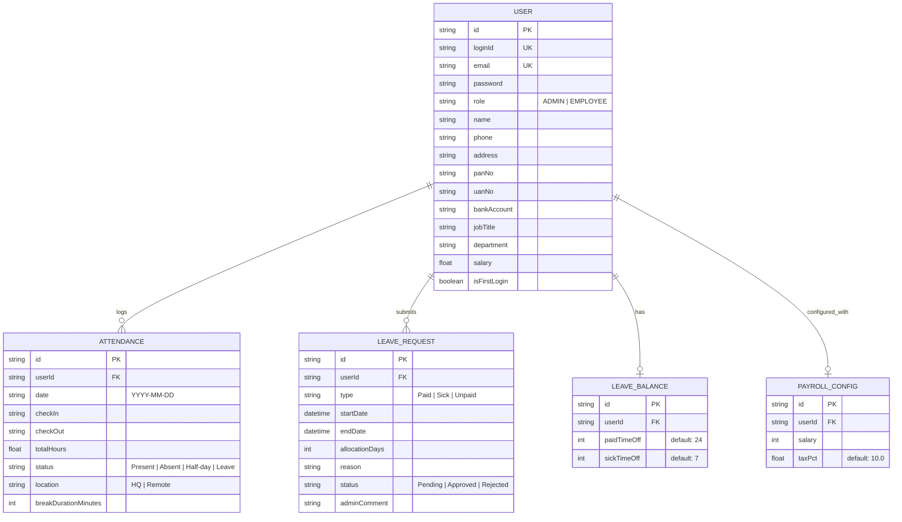
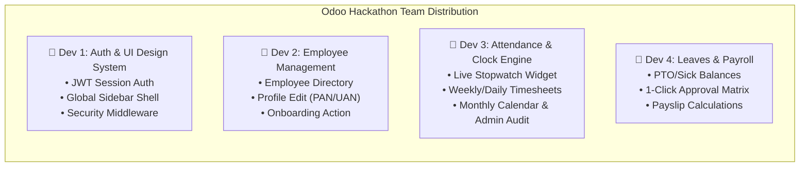

<div align="center">

# ⚡ Employa
### *Every workday, perfectly aligned.*

[](https://nextjs.org/)
[](https://www.typescriptlang.org/)
[](https://tailwindcss.com/)
[](https://www.prisma.io/)
[](https://employa-hrms.vercel.app/)

**Enterprise-Grade Human Resource Management System built for the Odoo Hackathon 2026**

🌐 **Live Deployment**: **[https://employa-hrms.vercel.app/](https://employa-hrms.vercel.app/)**

[Explore Live Demo](#-judge--evaluator-quick-test-credentials) • [Architecture](#-system-architecture--workflow-diagrams) • [Modules](#-core-modules--features) • [Installation](#-getting-started)

---
</div>

## 📌 Executive Summary

**Dayflow HRMS** is an integrated human resource management platform designed following strict Odoo ERP workflow standards. It delivers a unified workplace experience spanning multi-role authentication, interactive employee directories, a real-time stopwatch attendance engine, leave approval matrices, and salary structure configurations with automated payslip generation.

---

## 📐 System Architecture & Workflow Diagrams

### 1. 🏗️ High-Level System Architecture



---

### 2. ⏱️ Real-Time Attendance & Clock-In Lifecycle



---

### 3. 🌴 Leave Application & Approval Workflow



---

### 4. 🗄️ Database Entity-Relationship (ER) Model



---

## 👥 Team Division of Labor (4 Specialized Roles)



---

## 🚀 Core Modules & Features

### 🔐 1. Authentication & Role-Based Access Control (RBAC)
- **Login Credentials**: Standard login via Company Login ID (e.g. `DAYFLOWMASTER01`, `OIJODO20260002`) or Email.
- **Strict Role-Gating**: `ADMIN` / `HR` users access administrative consoles; `EMPLOYEE` users are restricted to their own profiles, punch sessions, and balances.
- **Password Security**: Passwords hashed with `bcryptjs` (salt rounds: 10). Session tokens stored in HTTP-only `jose` encrypted JWT cookies.

### 👥 2. Employee Profile & Admin Directory (`/employees`, `/profile`)
- **Searchable Team Directory**: Instant search across names, job titles, and departments.
- **Statutory HR Fields**: Dedicated tabs for PAN Number, 12-digit UAN, Bank Account, Salary, Phone, and Residential Address.
- **Live Creation**: Admin route (`/dashboard/employees/create`) auto-generates Login IDs and initial passwords.

### ⏱️ 3. Attendance Tracking & Real-Time Clock Engine (`/attendance`)
- **Live Stopwatch Work Timer**: Real-time counter ticking since check-in with dynamic pulse state badges (`Working Now`, `On Break`, `Clocked Out`).
- **Location Tagging**: Toggle between *HQ Office* and *Remote Work from Home*.
- **Interactive Visualizations**:
  - Daily step-progression timeline (Punch in, Lunch break, Punch out, Remarks).
  - Weekly timesheet bars against the standard 8-hour target.
  - Monthly attendance calendar (🟢 Present, 🟡 Half-Day, 🔴 Absent, 🔵 Leave).
- **Admin Audit Table & Regularization**: Searchable company registry with 1-click CSV export and manual timing adjustment modals.

### 🌴 4. Leave Approvals & Payroll Engine (`/time-off`, `/payroll`)
- **Leave Balance Cards**: Live trackers for Paid Time Off (24 days) and Sick Time Off (7 days).
- **Approval Matrix**: HR Admins can review pending leave applications and approve/reject with audit remarks.
- **Salary Computation & Payslips**: Reactive breakdown of Base Wage, HRA (50%), Standard Allowance, PF Deductions (12%), Professional Tax, and Net Take-Home Pay with printable payslip format.

---

## 🔑 Judge & Evaluator Quick Test Credentials

All 6 accounts are pre-seeded in the database with passwords verified:

| Role | Persona Name | Login ID | Email | Password | Primary Demo Feature |
|:---|:---|:---|:---|:---|:---|
| **ADMIN** | **Master Admin** | `DAYFLOWMASTER01` | `admin@dayflow.com` | `AdminPassword123!` | Full Admin Console & Metrics |
| **ADMIN** (HR) | **Emily Zhang** | `OIEMZH20260001` | `emily.hr@dayflow.com` | `Employee123!` | Leave Approvals & Regularization |
| **EMPLOYEE** | **John Doe** | `OIJODO20260002` | `john@dayflow.com` | `Employee123!` | Live Clock Widget & Attendance |
| **EMPLOYEE** | **Sarah Jenkins** | `OISJEN20260003` | `sarah@dayflow.com` | `Employee123!` | Profile Statutory PAN/UAN |
| **EMPLOYEE** | **Alex Rivera** | `OIARIV20260004` | `alex@dayflow.com` | `Employee123!` | Pending 3-Day Leave Request |
| **EMPLOYEE** | **Priya Sharma** | `OIPSHA20260005` | `priya@dayflow.com` | `Employee123!` | Half-day punch & Timesheet |

---

## ⚙️ Architecture & Code Quality Standards

Our codebase is structured with strict separation of concerns for enterprise scale:
- **Server Actions & Route Handlers**: Type-safe business operations under `src/app/actions` and `src/app/api`.
- **Modular Component Hierarchies**: Reusable component domains partitioned into `/attendance`, `/leave`, `/payroll`, and `/profile`.
- **Strict TypeScript & ESLint**: Fully type-checked across 24 routes with zero compiler warnings or lint errors.
- **Automated Vercel Deployments**: Continuous zero-downtime deployment synchronized with Prisma client generation.

---

## 💻 Getting Started

### Prerequisites
- **Node.js**: `v20.x` or `v22.x`
- **npm**: `v10.x` or higher

### Installation & Local Setup

1. **Clone the repository:**
   ```bash
   git clone https://github.com/ayushyadav0707/Odoo-2026.git
   cd Odoo-2026
   ```

2. **Install dependencies:**
   ```bash
   npm install
   ```

3. **Configure Environment Variables:**
   ```bash
   cp .env.example .env
   ```

4. **Initialize & Seed the Database:**
   ```bash
   npx prisma db push --force-reset
   npx tsx prisma/seed.ts
   ```

5. **Start the Development Server:**
   ```bash
   npm run dev
   ```
   Open **(https://employa-hrms.vercel.app/)** in your browser!

---

<div align="center">
Built with ❤️ for the <strong>Odoo Hackathon 2026</strong>
</div>
